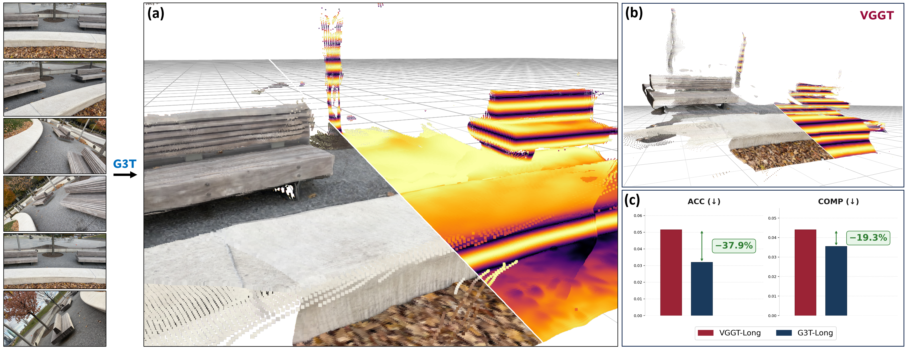

# G3T Up! Gravity Aligned Coordinate Frames Simplify Pointmap Processing 

[](https://g3t-paper.github.io/)
[](https://arxiv.org/)
[](https://huggingface.co/thatbrguy/g3t)

[Bharath Raj Nagoor Kani](https://bharathrajn.com/), [Noah Snavely](https://www.cs.cornell.edu/~snavely/) <br/>
Cornell University

<p align="center">
  
</p>

<p align="center"> We introduce <strong>G3T</strong>, a transformer that predicts upright, gravity-aligned pointmaps regardless of input image orientation, and <strong>G3T-Long</strong>, a pipeline that leverages this uprightness to enable robust long-sequence 3D reconstruction. Checkout our <a href="https://g3t-paper.github.io/">project page</a> for interactive visualizations.</p>

## Setup

To begin, create a conda environment:
```
conda create --name g3t python=3.10
conda activate g3t
```

Then, execute the following commands within the conda environment to install all dependencies:
```
pip install torch==2.8.0 torchvision==0.23.0 torchaudio==2.8.0 --index-url https://download.pytorch.org/whl/cu128
pip install -r requirements.txt
```

Pre-trained G3T model weights are available in [huggingface](https://huggingface.co/thatbrguy/g3t). By default, the inference script will automatically dowload the weights from this repository, but you can also manually download them if you prefer.

## Feed-forward inference using G3T

In this section, we demonstrate how to obtain upright, gravity-aligned 3D reconstruction of a scene using G3T from a collection of images.

### Step 1: Setup data

To begin, place your images in a folder. For demo purposes, we have included three self-captured scenes (the ones visualized in our [project page](https://g3t-paper.github.io/)) in `examples/g3t`.

### Step 2: Run inference

You can run inference by executing the below command:

```
python run_inference.py \
    --input "./examples/g3t/bench" \
    --output_dir "./output/bench" \
    --backend "feed_forward"
```

The script will automatically download pre-trained G3T weights from [HuggingFace](https://huggingface.co/thatbrguy/g3t). If you'd rather use a local checkpoint, you can provide the path using `--ckpt_path`. For a full list of supported options, check out `vggt/utils/inference_utils.py`.

### Step 3: Visualize results

Use our viser-based visualizer to explore the reconstruction:

```
python visualize_results.py --scene_root "./output/bench"
```

This opens the visualizer at http://localhost:27272 by default. See `visualize_results.py` for additional options.

## Long-sequence recontruction using G3T-Long

In this section, we demonstrate how to perform gravity-aligned submap-based reconstruction to process long video sequences robustly using G3T-Long.

> **NOTE:** The VGGT-Long codebase implements loop closure correction modules in both Python and C++. Currently we only support the Python based loop closure correction module for G3T-Long. We plan to extend support for the C++ solver in a future release.

### Step 1: Setup data

To begin, you should either provide a video, or a folder with a contiguous frames. If you pass a video, the script will automatically extract frames to a cache folder before processing.

For demo purposes, we provide a self-captured scene (the same one used in the alignment demo in the [project page](https://g3t-paper.github.io/)): [lounge.tar.gz](https://huggingface.co/thatbrguy/g3t/resolve/main/examples/g3t_long/lounge.tar.gz). You can download this file, extract it using `tar -xzvf lounge.tar.gz`, and place the contents in `examples/g3t_long/lounge`.

### Step 2: Setup weights

Follow the instructions in [download_weights.sh](https://github.com/DengKaiCQ/VGGT-Long/blob/main/scripts/download_weights.sh) in the VGGT-Long repository to download weights for SALAD, DINO and DBoW. Place the downloaded weights into `vggt_long/weights`. If you put them somewhere else, update the paths in `vggt_long/configs/g3t_long.yaml`.

### Step 3: Run inference

You can run inference by executing the below command:

```
python run_inference.py \
    --input "./examples/g3t_long/lounge" \
    --output_dir "./output/lounge" \
    --backend "g3t_long" \
    --loop_enable
```

As before, G3T weights are downloaded from HuggingFace automatically (override with --ckpt_path).

A few useful hyperparameters to experiment with: --chunk_size, --overlap, --loop_chunk_size, and --loop_enable. The --loop_enable flag activates the loop closure mechanism, though note that the pipeline may not always detect loop closure events even when it's enabled.

If you pass a video, frames are extracted to `cache/frames` by default (you can modify this using `--cache_dir`). By default, the script will extract every 5th frame (you can modify this using `--nth_frame`). See `vggt/utils/inference_utils.py` for the full list of options.

### Step 4: Visualize results

Use our viser-based visualizer to explore the reconstruction:

```
python visualize_results.py --scene_root "./output/lounge"
```

This opens the visualizer at http://localhost:27272 by default. See `visualize_results.py` for additional options.

## Training G3T

> **NOTE:** This section is not complete yet!

G3T was trained on gravity-aligned data from five large-scale datasets (MegaDepth, Hypersim, ARKitScenes, DL3DV and TartanAir). Our model was fine-tuned from the VGGT-1B checkpoint.

We plan to release the data preprocessing code and training code soon. In the meantime, if you would like to dig into some implementation details behind the training process, the files `g3t_trainer.py` and `train_utils/loss.py` should have some useful information.

## TODOs
- [ ] Complete the code release for the training section.
- [ ] Extend support for the C++ based loop closure mechanism for G3T-Long.

## Acknowledgements

We thank the authors of [DUSt3R](https://github.com/naver/dust3r), [VGGT](https://github.com/facebookresearch/vggt), [CUT3R](https://github.com/CUT3R/CUT3R), and [VGGT-Long](https://github.com/DengKaiCQ/VGGT-Long) for open-sourcing their projects, which our work builds upon. Additionally, we would like to thank Aditya Chetan, Haian Jin and Jay Karhade for their feedback on initial drafts of the paper.

## Citation

If you find our work useful, please consider citing our paper:

```
@article{kani2026g3t,
  author    = {Nagoor Kani, Bharath Raj and Snavely, Noah},
  title     = {G3T Up! Gravity Aligned Coordinate Frames Simplify Pointmap Processing},
  journal   = {arXiv preprint},
  year      = {2026},
}
```
